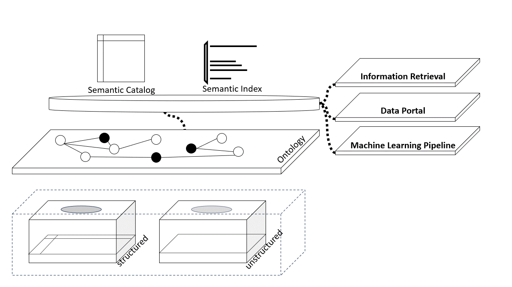

# Intellectu's Data  Lab

## Data Platform

Intellectu's Data  Lab은 Data Platform 의 요소 기술을 연구하고, 
엔지니어링 관점에서 데이터 관리 시스템을 구축하고 있습니다.

Data Platform은 데이터를 활용하고 관리하는데 필요한 기술적 역량을 제공하는 통합 시스템입니다. Data Platform을 구성하는 컴포넌트는 각각 데이터의 수집, 저장, 전처리, 전송을 지원하고 사용자 혹은 응용 프로그램에 데이터를 제공 합니다. 이러한 컴포넌트의 구성과 관계를 사용 목적에 따라 배치하고 정의하여 Data Platform 시스템을 구축할 수 있습니다. 

Data Fabric은 Intellectu's Data  Lab이 만들고 있는 Data Platform 시스템 입니다. 분산 환경에서 데이터에 대한 통합 관리를 가능하게 함으로써 데이터가 가진 잠재적 가치 실현을 지원하기 위한 전략을 내포하고 있습니다.

Intellectu's Data Fabric 시스템이 제공하는 기술 역량은 다음과 같습니다. 

## Active Metadata Management System

Active Metadata Management는 자동화 방식으로 데이터 관리 시스템에 연결된 데이터 세트에 대한 Metadata를 관리 합니다.

